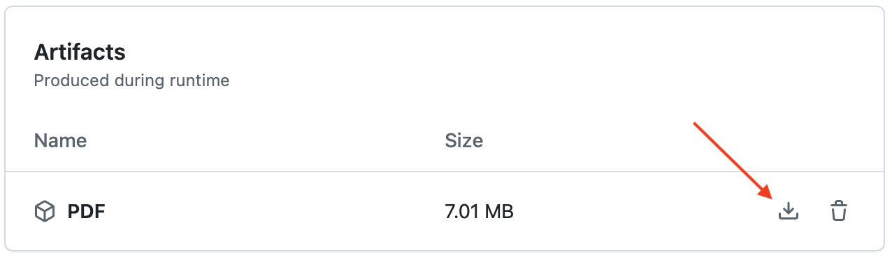

# Астрадь

[//]: todo: про лицензию, про пр и про ниже лежащие блоки

## Как скачать PDF

### Самый простой способ

Периодически в папку [/export](export) будут добавляться новые версии полностью скомпилированной книжки. Чтобы скачать файл, перейдя открыв данную папку, нужно

1. Нажать на название нужной версии 
2. В правом верхнем углу нажать на кнопку "Скачать" 

### Получить актуальную версию
Своевременно появление версий в [/export](export) не гарантировано, так как происходит вручную. Однако в репозитории настроены автоматические действия при появлении нового коммита – собирается проект и результат доступен в виде PDF. Чтобы его скачать, нужно
1. Перейти во вкладку [Actions](https://github.com/AShepelevv/astro.notebook/actions).
2. Если интересуют только "стабильные" версии, можно воспользоваться фильтром по ветке и указать там master. [Ссылка на фильтр](https://github.com/AShepelevv/astro.notebook/actions?query=branch%3Amaster)
3. Выбрать нужную сборку
4. Внизу страницы будет блок "Artifacts", единственный артифакт – это pdf. Справа кнопка, которой можно его скачать


_P.S._ К сожалению в публичных репозиториях артифакты хранятся не более 90 дней. Постараемся своевременно обновлять версии в `/export`, чтобы перекрывать этот промежуток

_P.S.S._ При сборке на сервере используется флаг `lightVersion`, что означается что несколько (~4-5) иллюстраций не будут отрисованы. Однако эти иллюстрации давно пришли к своему финальному виду, и pdf в `/export` собираются без этого флага.

## Сборка

### Системные требования

* [Tex Live 2024](https://www.tug.org/texlive/acquire-netinstall.html), полная версия
* Увеличить доступную оперативную память для LaTeX:
  * Например, на Mac OS нужно в файл `~/Library/texmf/web2c/texmf.cnf` (создать, если его нет) записать следующее:

  ```
  main_memory = 10000000
  extra_mem_bot = 2000000
  extra_mem_top = 2000000
  param_size = 10000
  ```

### Запуск

```bash
sh build.sh
```

Прогресс первой сборки (очень долгой) можно смотреть по увеливению количества файлов в папке [tikz/resource](tikz/resource). Там будет храниться локальный кэш картинок, сгенерированных с помощью TikZ.

## Соавторство

Свои правки и идеи новых разделов приносите в виде Pull Request в ветку master будем рады обсудить их и добавить в книжку.

Для разработки может понадобиться:

* [Python 3.*](https://www.python.org)
* [Jupyter Notebook](https://jupyter.org)
* [Wolfram Mathematica 14+](https://www.wolfram.com/mathematica/)
* [ipe](https://ipe.otfried.org) для правки старых иллюстрацих
